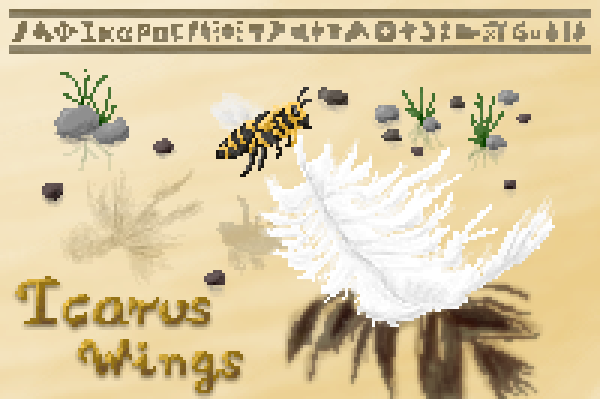

# LocusAzzurro's Icarus Wings Mod

**Icarus Wings** is a Minecraft mod taking inspiration from the Greek mythology of Icarus, revolving around elements related to wings and sky.

There are two main branches in this mod, one focusing on the Greek mythology, which gives players the ability to craft feather wings to fly in the early stages of survival, but with some limitations to not break the gameplay balance. This part of the mod also brings into Minecraft elements originating from Greek legends and culture.

The other branch is based on the anime/manga series [Heaven's Lost Property](https://en.wikipedia.org/wiki/Heaven%27s_Lost_Property), with the main heroine with the same name Ikaros. This branch is focused on end-game content which let players gather rare materials in adventures to create powerful gears and wings to fly freely.

This mod was an entry project for [Teacon 2021](https://teacon.cn/2021/).

中文版介绍与资料可查阅[MCMOD页面](https://www.mcmod.cn/class/4386.html)

